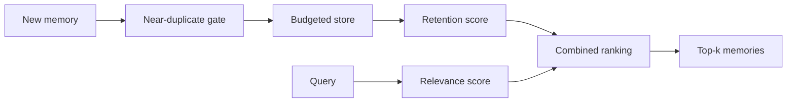

# Architecture

```mermaid
flowchart LR
  A[New memory] --> B[Near-duplicate gate]
  B --> C[Budgeted store]
  C --> D[Retention score]
  Q[Query] --> E[Relevance score]
  D --> F[Combined ranking]
  E --> F
  F --> G[Top-k memories]
```

Retention and retrieval are separate decisions. A memory can deserve long-term storage without being relevant to the current query.
